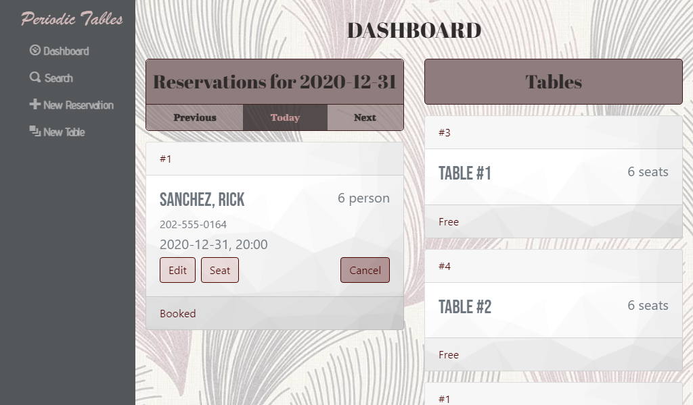
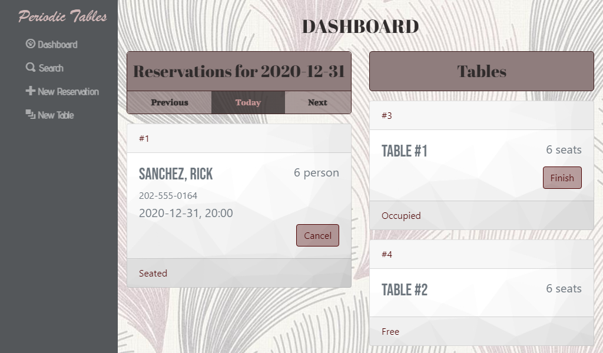
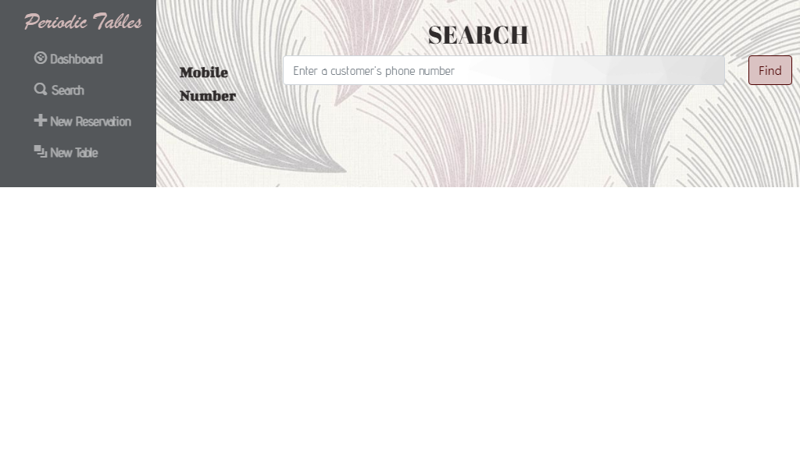
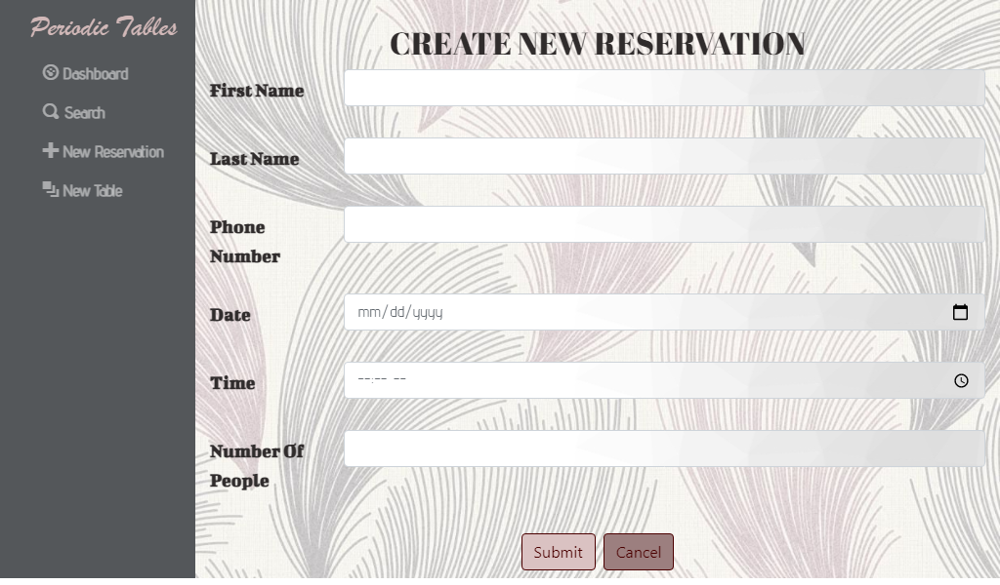
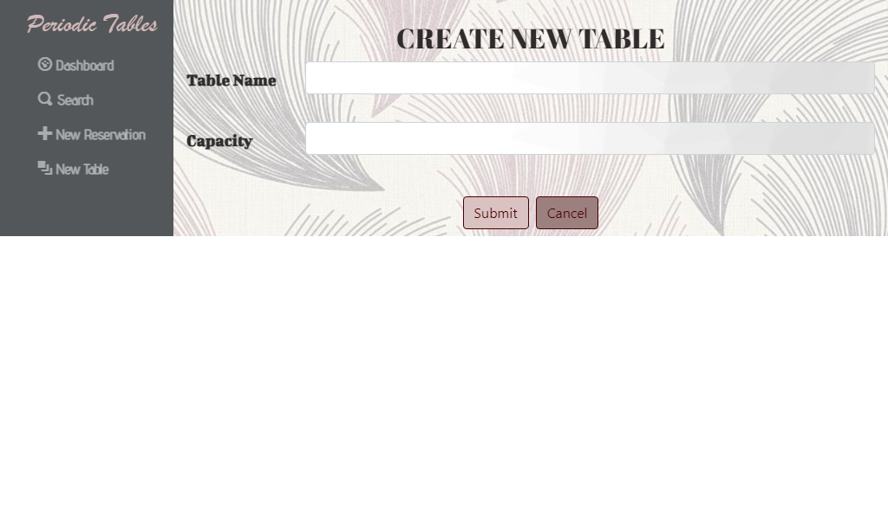
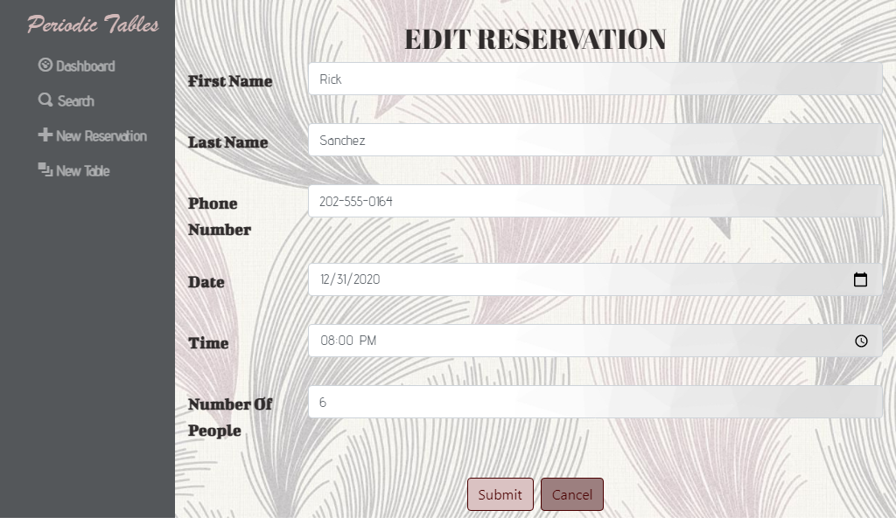
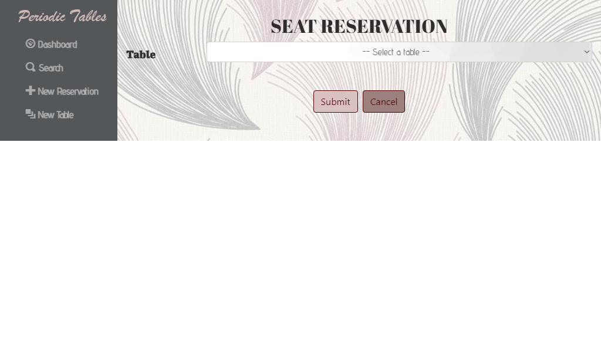

# Restaurant Reservation System
> This application provides various reservation functionality for a restaurant.
> It allows restaurant personnel to create, update, or cancel reservations, as well as to create tables.
> Further functionality such as assigning a reservation to a table and finishing a reservation are included.
> The dashboard displays the restaurant tables, and booked and seated reservations are shown in the dashboard by reservation date.
> The application also has a search by mobile number method which allows restaurant personnel to effortlessly catalog reservations.

## Live Application
### Front-end
https://rest-reserve-frontend-fc.herokuapp.com/
### Back-end
https://rest-reserve-backend-fc.herokuapp.com/

## Database setup

1. Set up a new database instance.
1. After setting up your database instance, assign the connection URL to the configuration variable `DATABASE_URL`.

### Knex

Run `npx knex` commands from within the `back-end` folder, which is where the `knexfile.js` file is located.

## Installation

1. Fork and clone this repository.
1. Run `cp ./back-end/.env.sample ./back-end/.env`.
1. Update the `./back-end/.env` file with the connection URL to your database instance.
1. Run `cp ./front-end/.env.sample ./front-end/.env`.
1. You should not need to make changes to the `./front-end/.env` file unless you want to connect to a backend at a location other than `http://localhost:5000`.
1. Run `npm install` to install project dependencies.
1. Run `npm run start` to start your server.

## Application Views

### Dashboard

### Search

### New Reservation

### New Table

### Edit Reservation

### Seat Reservation

## API Calls
### List Reservations

Returns json data containing array of reservations.

* **URL**

  /reservations

* **Method:**

  `GET`
  
* **URL Params**

  **Optional:**
 
   * `date=[date]`
   * `mobile_number=[string]`

* **Data Params**

  None

* **Success Response:**

  * **Code:** 200  
    **Content:** `{ "data" : [
    { "reservation_id": 1,
    "first_name": "Rick",
    "last_name": "Sanchez",
    "mobile_number": "202-555-0164",
    "reservation_date": "2020-12-31",
    "reservation_time": "20:00:00",
    "people": 6,
    "status": "booked",
    "created_at": "2020-12-10T08:30:32.326Z",
    "updated_at": "2020-12-10T08:30:32.326Z" },
    {
    "first_name": "Frank",
    "last_name": "Palicky",
    "mobile_number": "202-555-0153",
    "reservation_date": "2020-12-30",
    "reservation_time": "20:00",
    "people": 1,
    "created_at": "2020-12-10T08:31:32.326Z",
    "updated_at": "2020-12-10T08:31:32.326Z"
    }
    ] }`
  
### Create Reservation

Inserts a reservation into the database.
Returns json data of created reservation.

* **URL**

  /reservations

* **Method:**

  `POST`
  
* **URL Params**

  None

* **Data Params**

  **Required:**
 
   * `first_name=[string]`
   * `last_name=[string]`
   * `mobile_number=[string]`
   * `reservation_date=[date]`
   * `reservation_time=[time]`
   * `people=[integer]`

* **Success Response:**

  * **Code:** 201  
    **Content:** `{ "data" :
    { "reservation_id": 1,
    "first_name": "Rick",
    "last_name": "Sanchez",
    "mobile_number": "202-555-0164",
    "reservation_date": "2020-12-31",
    "reservation_time": "20:00:00",
    "people": 6,
    "status": "booked",
    "created_at": "2020-12-10T08:30:32.326Z",
    "updated_at": "2020-12-10T08:30:32.326Z" }
    }`
 
* **Error Response:**

  * **Code:** 400  
    **Content:** `{ error : "data is required." }`
    OR
    `{ error : "first_name, last_name is required." }`
    OR
    `{ error : "people property should be a number" }`
    OR
    `{ error : "people property must be greater than 0" }`
    OR
    `{ error : "reservation_date property should be a date" }`
    OR
    `{ error : "reservation_time property should be a time" }`
    OR
    `{ error : "The restaurant is closed on Tuesdays. Please select another day." }`
    OR
    `{ error : "Reservation must be set in the future. Please select another date." }`
    OR
    `{ error : "The restaurant opens at 10:30 AM. Please select another time." }`
    OR
    `{ error : "The restaurant closes at 10:30 PM. Please select a time before 9:30 PM." }`
    OR
    `{ error : "The reservation status can't be seated or finished. Please create a new reservation." }`
  
### List Reservation

Returns json about a single reservation.

* **URL**

  /reservations/:reservation_id

* **Method:**

  `GET`
  
* **URL Params**

  None

* **Data Params**

  None

* **Success Response:**

  * **Code:** 200  
    **Content:** `{ "data" :
    { "reservation_id": 1,
    "first_name": "Rick",
    "last_name": "Sanchez",
    "mobile_number": "202-555-0164",
    "reservation_date": "2020-12-31",
    "reservation_time": "20:00:00",
    "people": 6,
    "status": "booked",
    "created_at": "2020-12-10T08:30:32.326Z",
    "updated_at": "2020-12-10T08:30:32.326Z" }
    }`
    
* **Error Response:**

  * **Code:** 404 NOT FOUND  
    **Content:** `{ error : "Reservation id 1 does not exist." }`

### Update Reservation

Updates a reservation in the database.
Returns json data of updated reservation.

* **URL**

  /reservations/:reservation_id

* **Method:**

  `PUT`
  
* **URL Params**

  None

* **Data Params**

  **Required:**
 
   * `first_name=[string]`
   * `last_name=[string]`
   * `mobile_number=[string]`
   * `reservation_date=[date]`
   * `reservation_time=[time]`
   * `people=[integer]`

* **Success Response:**

  * **Code:** 200  
    **Content:** `{ "data" :
    { "reservation_id": 1,
    "first_name": "Rick",
    "last_name": "Sanchez",
    "mobile_number": "202-555-0164",
    "reservation_date": "2020-12-31",
    "reservation_time": "20:00:00",
    "people": 6,
    "status": "booked",
    "created_at": "2020-12-10T08:30:32.326Z",
    "updated_at": "2020-12-10T08:30:32.326Z" }
    }`
    
* **Error Response:**

  * **Code:** 404 NOT FOUND  
    **Content:** `{ error : "Reservation id 1 does not exist" }`
  
  OR
  
  * **Code:** 400  
    **Content:** `{ error : "data is required." }`
    OR
    `{ error : "first_name, last_name is required." }`
    OR
    `{ error : "people property should be a number" }`
    OR
    `{ error : "people property must be greater than 0" }`
    OR
    `{ error : "reservation_date property should be a date" }`
    OR
    `{ error : "reservation_time property should be a time" }`
    OR
    `{ error : "The restaurant is closed on Tuesdays. Please select another day." }`
    OR
    `{ error : "Reservation must be set in the future. Please select another date." }`
    OR
    `{ error : "The restaurant opens at 10:30 AM. Please select another time." }`
    OR
    `{ error : "The restaurant closes at 10:30 PM. Please select a time before 9:30 PM." }`
    OR
    `{ error : "The reservation status can't be seated or finished. Please create a new reservation." }`
  
### Update Reservation Status

Updates a reservation's status to either "seated", "finished", or "cancelled".
Returns json data of updated reservation.

* **URL**

  /reservations/:reservation_id/status

* **Method:**

  `PUT`
  
* **URL Params**

  None

* **Data Params**

  **Required:**
 
   * `status=[string]`

* **Success Response:**

  * **Code:** 200  
    **Content:** `{ "data" :
    { "reservation_id": 1,
    "first_name": "Rick",
    "last_name": "Sanchez",
    "mobile_number": "202-555-0164",
    "reservation_date": "2020-12-31",
    "reservation_time": "20:00:00",
    "people": 6,
    "status": "seated",
    "created_at": "2020-12-10T08:30:32.326Z",
    "updated_at": "2020-12-10T08:30:32.326Z" },
    {
    }`
    
* **Error Response:**

  * **Code:** 404 NOT FOUND  
    **Content:** `{ error : "Reservation id 1 does not exist" }`
  
  OR
  
  * **Code:** 400  
    **Content:** `{ error : "Reservation status reserved is unknown" }`
    OR
    `{ error : "Reservation is already finished. A finished reservation cannot be updated." }`
  
### List Tables

Returns json data containing array of tables.

* **URL**

  /tables

* **Method:**

  `GET`
  
* **URL Params**

  None

* **Data Params**

  None

* **Success Response:**

  * **Code:** 200  
    **Content:** `{ "data" : [
    { "table_id": 1,
    "table_name": "Bar #1",
    "capacity": 1,
    "reservation_id": null,
    "created_at": "2022-03-15T16:03:39.797Z",
    "updated_at": "2022-03-15T16:03:39.797Z"
    },
    { "table_id": 2,
    "table_name": "Bar #2",
    "capacity": 1,
    "reservation_id": null,
    "created_at": "2022-03-15T16:03:39.797Z",
    "updated_at": "2022-03-15T16:03:39.797Z"
    }
    ] }`
  
### Create Table

Inserts a table into the database.
Returns json data of created table.

* **URL**

  /tables

* **Method:**

  `POST`
  
* **URL Params**

  None

* **Data Params**

  **Required:**
 
   * `table_name=[string]`
   * `capacity=[integer]`

* **Success Response:**

  * **Code:** 201  
    **Content:** `{ "data" : 
    { "table_id": 3,
    "table_name": "Bar #3",
    "capacity": 3,
    "reservation_id": null,
    "created_at": "2022-03-15T16:03:39.797Z",
    "updated_at": "2022-03-15T16:03:39.797Z"
    }
    }`
 
* **Error Response:**

  * **Code:** 400  
    **Content:** `{ error : "data is required." }`
    OR
    `{ error : "table_name is required." }`
    OR
    `{ error : "table_name property must be more than 2 characters" }`
    OR
    `{ error : "capacity property should be a number" }`
    OR
    `{ error : "capacity field must be greater than 0" }`
  
### List Table

Returns json about a single table.

* **URL**

  /tables/:table_id

* **Method:**

  `GET`
  
* **URL Params**

  None

* **Data Params**

  None

* **Success Response:**

  * **Code:** 200  
    **Content:** `{ "data" :
    { "table_id": 1,
    "table_name": "Bar #1",
    "capacity": 1,
    "reservation_id": null,
    "created_at": "2022-03-15T16:03:39.797Z",
    "updated_at": "2022-03-15T16:03:39.797Z"
    }
    }`
    
* **Error Response:**

  * **Code:** 404 NOT FOUND  
    **Content:** `{ error : "Table id 1 does not exist" }`
  
### Seat Reservation

Assigns a reservation to a table.
Returns json data of assigned table.

* **URL**

  /tables/:table_id/seat

* **Method:**

  `PUT`
  
* **URL Params**

  None

* **Data Params**

  **Required:**
 
   * `reservation_id=[integer]`

* **Success Response:**

  * **Code:** 200  
    **Content:** `{ "data" : 
    { "table_id": 1,
    "table_name": "Bar #1",
    "capacity": 1,
    "reservation_id": 1,
    "created_at": "2022-03-15T16:03:39.797Z",
    "updated_at": "2022-03-15T16:03:39.797Z"
    }
    }`
    
* **Error Response:**

  * **Code:** 404 NOT FOUND  
    **Content:** `{ error : "Reservation id 1 does not exist." }`
  
  OR
  
  * **Code:** 400  
    **Content:** `{ error : "data is required." }`
    OR
    `{ error : "reservation_id is required." }`
    OR
    `{ error : "The number of people reserved exceeds the seating capacity of this table. Please select another table." }`
    OR
    `{ error : "The table is occupied. Please select another table." }`
    OR
    `{ error : "Reservation is already seated." }`
  
### Finish Reservation

Removes a reservation from a table.
Returns json data of unoccupied table.

* **URL**

  /tables/:table_id/seat

* **Method:**

  `DELETE`
  
* **URL Params**

  None

* **Data Params**

  **Optional:**
 
   * `reservation_id=[integer]`

* **Success Response:**

  * **Code:** 200  
    **Content:** `{ "data" : 
    { "table_id": 1,
    "table_name": "Bar #1",
    "capacity": 1,
    "reservation_id": null,
    "created_at": "2022-03-15T16:03:39.797Z",
    "updated_at": "2022-03-15T16:03:39.797Z"
    }
    }`
    
* **Error Response:**

  * **Code:** 404 NOT FOUND  
    **Content:** `{ error : "Table id 1 does not exist." }`
  
  OR
  
  * **Code:** 400  
    **Content:** `{ error : "The table is not occupied." }`

## Technology Used
* React
* Knex
* Bootstrap
* ElephantSQL
* Heroku
